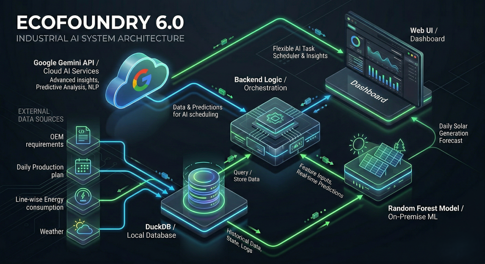
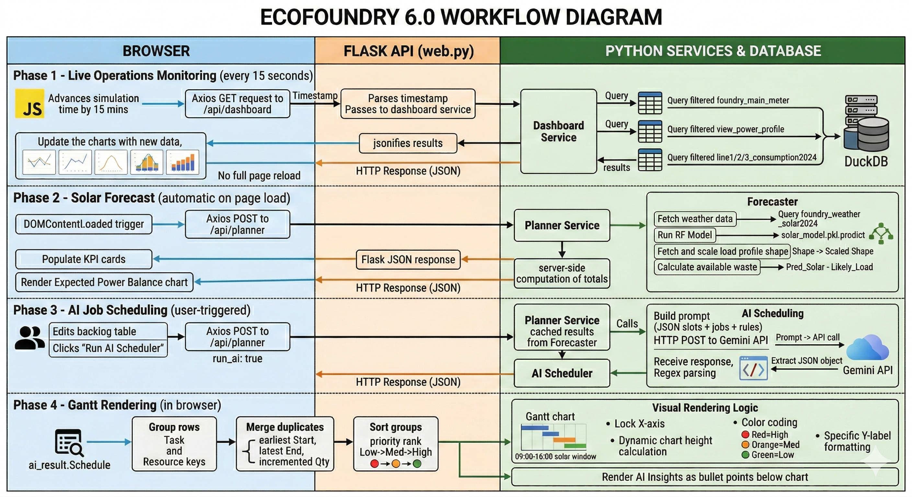
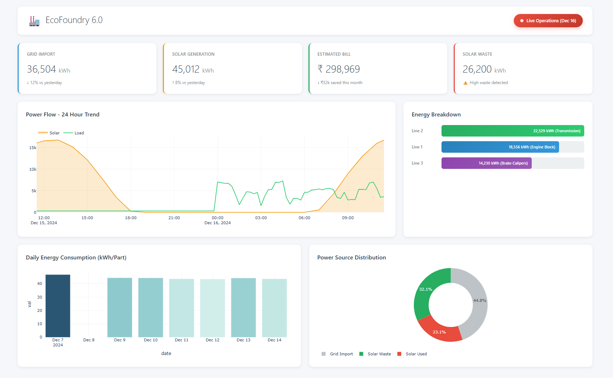
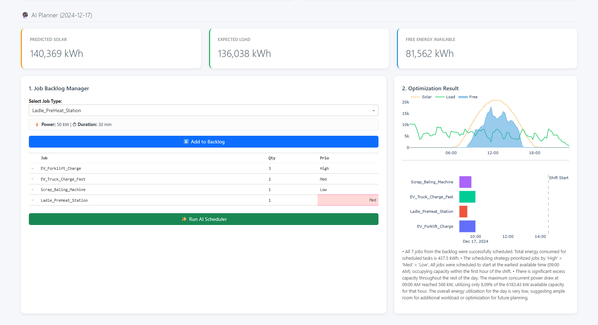

# EcoFoundry 6.0 – Renewable Energy Optimization Dashboard

A full-stack industrial IoT dashboard that simulates live energy monitoring, ML-based solar forecasting, and AI-powered job scheduling for a solar-equipped foundry. Deployed on **Render** using Flask + DuckDB + Plotly.js.




---

## System Architecture

EcoFoundry 6.0 follows a modular, cloud-friendly design with a clear separation between presentation, application logic, and data layers.

```
┌─────────────────────────────────────────────────────────────────────┐
│                        PRESENTATION LAYER                           │
│                                                                     │
│   Browser (HTML / CSS / JavaScript)                                 │
│   ├── Bootstrap 5 grid + custom styles (static/css/styles.css)      │
│   ├── Plotly.js (CDN) – Power Flow, Gantt, Forecast charts          │
│   ├── Axios – async JSON API calls to the Flask backend             │
│   └── Jinja2 templates (templates/dashboard.html)                   │
│          ↕  HTTP / JSON                                             │
├─────────────────────────────────────────────────────────────────────┤
│                        APPLICATION LAYER                            │
│                                                                     │
│   Flask Web Server (web.py)                                         │
│   ├── GET  /              → renders dashboard.html (Jinja2)         │
│   ├── GET  /api/dashboard → live KPIs, power profile, line data     │
│   └── POST /api/planner  → forecast + optional AI schedule          │
│                                                                     │
│   Business Logic Services                                           │
│   ├── dashboard_service.py  – aggregates KPIs & chart data          │
│   ├── planner_service.py    – orchestrates forecast + AI call       │
│   ├── forecaster.py         – RF model inference + free energy calc │
│   └── ai_scheduler.py       – Gemini API prompt + JSON parsing      │
│          ↕  Python / SQL                                            │
├─────────────────────────────────────────────────────────────────────┤
│                           DATA LAYER                                │
│                                                                     │
│   DuckDB (data/energy.duckdb)                                       │
│   ├── foundry_main_meter        – 15-min meter readings (2024)      │
│   ├── foundry_weather_solar2024 – irradiance & temperature data     │
│   ├── line1/2/3_consumption2024 – per-line energy consumption       │
│   ├── foundry_daily_production_plan_verified – production schedule  │
│   ├── view_power_profile        – derived view (Solar + Load)       │
│   └── view_efficiency           – derived view (solar fraction/day) │
│                                                                     │
│   ML Model (solar_model.pkl)                                        │
│   └── Pre-trained Random Forest for hour-by-hour solar prediction   │
│          ↕  REST / HTTPS                                            │
├─────────────────────────────────────────────────────────────────────┤
│                      EXTERNAL INTEGRATIONS                          │
│                                                                     │
│   Google Gemini API                                                 │
│   └── Receives JSON prompt (energy slots + job backlog)             │
│       Returns optimized schedule array + strategic insights         │
└─────────────────────────────────────────────────────────────────────┘
```

### Layer Details

#### 1. Presentation Layer (Frontend)
- **`templates/dashboard.html`** — Single-page Jinja2 template. Houses both the Live Operations Dashboard and the integrated AI Planner in one scroll. No page reloads means the live simulation clock never resets.
- **Bootstrap 5** — Responsive grid, KPI cards, form controls (backlog table).
- **Plotly.js (CDN)** — Renders all four chart types entirely in the browser: Power Flow trend, Line Consumption bars, AI Optimized Schedule (Gantt), and Expected Power Balance forecast.
- **Axios** — Makes non-blocking JSON requests to Flask API endpoints every 15 seconds for live data and on-demand for the planner.
- **`static/css/styles.css`** — Custom overrides: KPI card hover states, backlog row selection highlight, layout spacing.

#### 2. Application Layer (Backend)
- **`web.py`** — Flask app factory (`create_app()`). Defines all routes and API endpoints. Loads `Intermittent_Job_Specs.csv` once at startup and passes it to the template as Jinja context.
- **`utils/db_manager.py`** — `DBManager` class: opens a DuckDB connection (path resolved from `DUCKDB_PATH` env var), runs arbitrary SQL via `db.query()`, and provides `get_live_chart_data()` for the time-windowed power profile.
- **`utils/dashboard_service.py`** — Accepts a simulated timestamp, runs KPI aggregation and line-breakdown queries against DuckDB, and returns a structured dict ready for `jsonify`.
- **`utils/forecaster.py`** — Loads `solar_model.pkl`, fetches tomorrow's weather from DuckDB, runs Random Forest inference, calculates `Available_Waste = Predicted_Solar − Likely_Load`, and returns a per-hour forecast DataFrame.
- **`utils/planner_service.py`** — Orchestration layer: calls the forecaster, computes totals (solar / load / free kWh), and conditionally calls the AI scheduler if `run_ai=True` and a backlog is provided.
- **`utils/ai_scheduler.py`** — Builds an engineered prompt containing the free-energy slots and job backlog, sends it to Google Gemini, and uses Regex to strip conversational text and isolate the returned JSON schedule.
- **`utils/bootstrap_duckdb.py`** — Build-time utility that reads all CSVs from `data/` and loads them into DuckDB tables and views. Runs once during `render` build step; not part of the request path.

#### 3. Data Layer
- **DuckDB** (`data/energy.duckdb`) — Embedded analytical database. Rebuilt from CSV source files at each deployment via the bootstrap script. Never stored in git.
- **CSV source files** (`data/*.csv`) — Raw historical data committed to git; serve as the single source of truth for rebuilding the database.
- **`solar_model.pkl`** — Serialized `sklearn` Random Forest model trained on historical irradiance features. Loaded once at startup by `forecaster.py`.

#### 4. External Integrations
- **Google Gemini API** — Receives a carefully engineered JSON prompt that encodes energy slot availability, job power requirements, duration, quantity, and priority. Returns a structured JSON schedule with per-task start/end times and strategic insights. API key injected via `GEMINI_API_KEY` environment variable.

---

## Application Workflow

### Phase 1 — Live Operations Monitoring (every 15 seconds)

```
Browser JS clock advances simTime by 15 minutes
        │
        ▼
Axios GET /api/dashboard?ts=2024-12-16T17:15:00
        │
        ▼
web.py parses ts → passes to dashboard_service.get_dashboard_data(current_time)
        │
        ├── KPI query:   foundry_main_meter  WHERE Timestamp >= '2024-12-16 00:00:00'
        │                                    AND   Timestamp <= current_time
        │                → Grid Import kWh, Solar kWh, Estimated Bill, Solar Waste
        │
        ├── Profile:     view_power_profile  same window
        │                → 15-min Solar + Load series for Power Flow chart
        │
        └── Line break:  line1/2/3_consumption2024  same window
                         → kWh per production line for bar chart
        │
        ▼
Flask jsonifies all results (datetime columns → ISO strings)
        │
        ▼
Axios receives JSON → Plotly.newPlot() redraws all 5 chart areas in-browser
No full page reload — simulation clock continues uninterrupted


```

### Phase 2 — Solar Forecast (automatic on page load)

```
DOMContentLoaded fires in browser
        │
        ▼
Axios POST /api/planner  { date: "2024-12-17", backlog: [...], run_ai: false }
        │
        ▼
planner_service.get_forecast_and_schedule(date, backlog, run_ai=False)
        │
        ▼
forecaster.generate_forecast("2024-12-17")
        │
        ├── Fetch weather:  foundry_weather_solar2024  for 2024-12-17
        │                   → Irradiance, Cloud Cover, Temperature (96 rows)
        │
        ├── RF Model:       solar_model.pkl.predict(weather_features)
        │                   → Pred_Solar kWh per 15-min slot
        │
        ├── Load profile:   foundry_main_meter  weekday historical shape
        │                   → Scaled by production plan for 2024-12-17
        │                   → Likely_Load kWh per slot
        │
        └── Free energy:    Available_Waste = Pred_Solar − Likely_Load  (floored at 0)
        │
        ▼
Totals computed: total predicted solar / expected load / free energy (kWh)
        │
        ▼
Flask returns JSON { forecast: [...96 rows], totals: {solar, load, free} }
        │
        ▼
Browser populates 3 Planner KPI cards + renders "Expected Power Balance" chart
AI Optimized Schedule section stays blank until user triggers Phase 3
```

### Phase 3 — AI Job Scheduling (user-triggered)

```
User edits Job Backlog table (job type, qty, priority)
User clicks "Run AI Scheduler"
        │
        ▼
Axios POST /api/planner  { date: "2024-12-17", backlog: [...], run_ai: true }
        │
        ▼
planner_service  →  forecaster  (same as Phase 2, result cached in memory)
        │
        ▼
ai_scheduler.get_optimized_schedule(slots_json, backlog, target_date)
        │
        ├── Build prompt:  encodes free-energy slots + job list as JSON
        │                  Rules: priority order, sequential Qty, 09:00–16:00 window,
        │                         power-constraint enforcement, no resource overlaps
        │
        ├── Gemini API:    HTTP POST → model generates JSON schedule
        │
        └── Regex parse:   strips markdown/prose → isolates JSON object
        │
        ▼
Schedule array: [ { Task, Start, End, Resource, Priority }, ... ]
        │
        ▼
Flask returns JSON { forecast, totals, ai_result: { Schedule, Insights } }
```

### Phase 4 — Gantt Rendering (in browser)

```
Browser receives ai_result.Schedule
        │
        ▼
Group rows by (Task, Resource) key
→ Multiple units of same task merged: earliest Start → latest End (= full sequential duration)
→ Qty counter incremented per merge
        │
        ▼
Sort groups by Priority rank:  Low → Med → High
(Plotly categorical y-axis renders last item at TOP → High priority appears at top)
        │
        ▼
Build Plotly horizontal bar traces:
  x  = duration in milliseconds
  base = start timestamp (epoch ms)
  orientation = 'h'
  color = priority  (Red=High / Orange=Med / Green=Low)
  y-label = "[Priority] Task Name (Qty N) – Resource"
        │
        ▼
X-axis locked to solar window: 09:00 → 16:00 on forecast date
Dynamic chart height: 65 px × number of task rows
        │
        ▼
AI Insights text rendered below chart as bullet points
```



---

## Environment Variables

| Variable | Required | Description |
|---|---|---|
| `GEMINI_API_KEY` | **Yes** | Google Gemini API key — AI scheduling disabled without it |
| `DASHBOARD_DATE` | No | Date the live simulation runs against (default: `2024-12-16`) |
| `PLANNER_DATE` | No | Forecast target date for the AI planner (default: `2024-12-17`) |
| `DUCKDB_PATH` | No | Absolute path to the `.duckdb` file — defaults to `data/energy.duckdb` relative to the app |
| `PORT` | No | Injected automatically by Render |

---
##outputs





## Project Structure

```
Ecofoundry_dash_3.0/
├── web.py                          # Flask app factory, routes, API endpoints
├── Procfile                        # Gunicorn start command (Render / Railway)
├── render.yaml                     # Render infrastructure-as-code config
├── requirements.txt                # Python dependencies
├── solar_model.pkl                 # Pre-trained Random Forest model
│
├── templates/
│   └── dashboard.html              # Single-page Jinja2 template (dashboard + planner)
│
├── static/
│   └── css/styles.css              # Custom styles and KPI card overrides
│
├── utils/
│   ├── db_manager.py               # DuckDB connection and query helper
│   ├── dashboard_service.py        # KPI + chart data aggregation
│   ├── forecaster.py               # Solar ML inference + free energy calculation
│   ├── planner_service.py          # Forecast + AI scheduling orchestrator
│   ├── ai_scheduler.py             # Gemini API prompt engineering + JSON parsing
│   └── bootstrap_duckdb.py         # Build-time CSV → DuckDB loader
│
└── data/
    ├── energy.duckdb               # ← NOT in git (built at deploy time)
    ├── Foundry_Main_Meter_15min2024.csv
    ├── Foundry_Weather_Solar2024.csv
    ├── Line1/2/3_Consumption2024.csv
    ├── Foundry_Daily_Production_Plan_Verified.csv
    └── Intermittent_Job_Specs.csv  # Job types and power/duration specs
```
